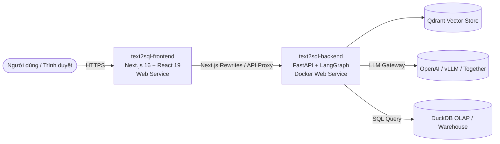

# Hướng Dẫn Triển Khai Lên Render (Render Blueprint Deployment)

Hệ thống **AI-Agent Text-to-SQL Self-Service Analytics** đã được cấu hình sẵn tệp hạ tầng dạng mã nguồn (`render.yaml`), cho phép bạn triển khai toàn bộ hệ thống gồm **FastAPI Backend (Docker)** và **Next.js Frontend (Node.js)** lên nền tảng đám mây [Render.com](https://render.com) chỉ với 1 cú click (Blueprint).

---

## 🏗️ Kiến Trúc Dịch Vụ Trên Render

| Tên Dịch Vụ | Loại | Môi Trường | Port | Ghi Chú |
| :--- | :--- | :--- | :--- | :--- |
| **`text2sql-backend`** | Web Service | Docker (`backend/Dockerfile`) | Tự động qua `$PORT` | Xử lý Text-to-SQL Agent, SSE Stream, RBAC Auth |
| **`text2sql-frontend`** | Web Service | Node 20 (`frontend/`) | Tự động qua `$PORT` | Giao diện Next.js 16, tự kết nối backend qua `BACKEND_API_URL` |

---

## 🚀 Các Bước Triển Khai (3 Bước Đơn Giản)

### Bước 1: Đăng nhập vào Render
1. Truy cập [dashboard.render.com](https://dashboard.render.com) và đăng nhập bằng tài khoản GitHub của bạn.

### Bước 2: Tạo Blueprint Mới
1. Nhấn nút **"New +"** ở góc trên cùng bên phải.
2. Chọn **"Blueprint"**.
3. Kết nối với repository GitHub của bạn: `kien3007/AI-Agent-Text-to-SQL-Self-Service-Analytics`.
4. Render sẽ tự động phát hiện tệp `render.yaml` ở thư mục gốc và phân tích ra 2 Web Services (`text2sql-backend` và `text2sql-frontend`).
5. Đặt tên cho Blueprint Instance (ví dụ: `ai-agent-text2sql`).

### Bước 3: Điền Biến Môi Trường & Apply
Trước khi nhấn **"Apply"**, Render sẽ yêu cầu bạn điền các biến môi trường chưa có giá trị mặc định (`sync: false`):
* `LLM_BASE_URL`: Địa chỉ API của LLM (ví dụ: `https://api.openai.com/v1` hoặc để trống nếu chạy mock simulation).
* `LLM_API_KEY`: Khóa API (ví dụ: `sk-...` hoặc `EMPTY`).

Nhấn **"Apply"**. Render sẽ tự động:
1. Build Docker image cho Backend.
2. Build Next.js bundle cho Frontend.
3. Tự động kết nối URL của Backend vào Frontend qua biến `BACKEND_API_URL`.

---

## ⚙️ Các Biến Môi Trường Quan Trọng

### Backend (`text2sql-backend`)
| Biến | Giá Trị Mặc Định | Mô Tả |
| :--- | :--- | :--- |
| `JWT_SECRET_KEY` | *(Render tự sinh)* | Khóa bí mật mã hóa JWT (tự động tạo ngẫu nhiên an toàn) |
| `APP_ENV` | `production` | Chế độ chạy ứng dụng |
| `CORS_ORIGINS` | `*` | Cho phép các domain gọi API |
| `MODEL_REASONER` | `Qwen/Qwen2.5-72B-Instruct` | Mô hình suy luận bài toán |
| `MODEL_CODER` | `Qwen/Qwen2.5-Coder-32B-Instruct` | Mô hình sinh câu lệnh SQL |
| `ANALYST_USERNAME` | `analyst` | Tài khoản phân tích viên mặc định |
| `ANALYST_PASSWORD` | `analyst123` | Mật khẩu tài khoản phân tích viên |
| `ADMIN_USERNAME` | `admin` | Tài khoản quản trị viên mặc định |
| `ADMIN_PASSWORD` | `admin123` | Mật khẩu tài khoản quản trị viên |

### Frontend (`text2sql-frontend`)
| Biến | Giá Trị Mặc Định | Mô Tả |
| :--- | :--- | :--- |
| `BACKEND_API_URL` | Liên kết từ `text2sql-backend` | Host của Backend Service trên Render |
| `NODE_ENV` | `production` | Môi trường Node.js |
| `NEXT_TELEMETRY_DISABLED` | `1` | Tắt gửi dữ liệu telemetry Next.js |

---

## 💡 Lưu Ý Khi Sử Dụng Gói Free Của Render
1. **Chế độ ngủ (Spin-down khi rảnh):** Trên gói Free, nếu dịch vụ không nhận request trong 15 phút, Render sẽ tạm đưa container về chế độ ngủ. Lần truy cập tiếp theo sẽ mất khoảng 30–50 giây để khởi động lại (cold start).
2. **Persistent Storage:** Gói Free của Render sử dụng ephemeral storage (dữ liệu trong container sẽ được làm mới khi redeploy). Nếu cần lưu trữ vector database Qdrant lâu dài giữa các lần deploy, bạn có thể nâng cấp Backend lên gói `Starter` và gắn một Render Disk vào thư mục `/app/data/qdrant_db`.
